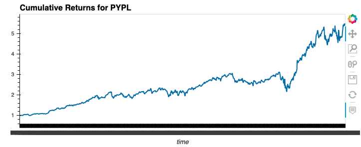
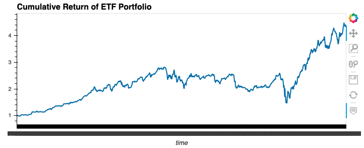

# ETF_Analyzer

## Instructions
Analyze the daily returns of the ETF stocks both individually and as a whole. Then deploy the visualizations to a web application by using the Voilà library.

The detailed instructions are divided into the following parts:
    
    * Analyze a single asset in the ETF
    * Optimize data access with advanced SQL queries
    * Analyze the ETF portfolio
    * Deploy the notebook as a web application
    
## Analyze a Single Asset in the ETF
For this part of the assignment, you’ll use SQL queries with Python, Pandas, and hvPlot to analyze the performance of a single asset from the ETF.

Complete the following steps:

* Write a SQL SELECT statement by using an f-string that reads all the PYPL data from the database. Using the SQL SELECT statement, execute a query that reads the PYPL data from the database into a Pandas DataFrame.

* Use the head and tail functions to review the first five and the last five rows of the DataFrame. Make a note of the beginning and end dates that are available from this dataset. You’ll use this information to complete your analysis.

* Using hvPlot, create an interactive visualization for the PYPL daily returns. Reflect the “time” column of the DataFrame on the x-axis. Make sure that you professionally style and format your visualization to enhance its readability.

* Using hvPlot, create an interactive visualization for the PYPL cumulative returns. Reflect the “time” column of the DataFrame on the x-axis. Make sure that you professionally style and format your visualization to enhance its readability.

## Optimize Data Access with Advanced SQL Queries
For this part of the assignment, you’ll continue to analyze a single asset (PYPL) from the ETF. You’ll use advanced SQL queries to optimize the efficiency of accessing data from the database.

Complete the following steps:

* Access the closing prices for PYPL that are greater than 200 by completing the following steps:
    * Write a SQL SELECT statement to select the dates where the PYPL closing price was higher than 200.0.
    * Using the SQL statement, read the data from the database into a Pandas DataFrame, and then review the resulting DataFrame.
    * Select the “time” and “close” columns for those dates where the closing price was higher than 200.0.
    
* Find the top 10 daily returns for PYPL by completing the following steps:
    * Write a SQL statement to find the top 10 PYPL daily returns. Make sure to do the following:
        * Use SELECT to select only the “time” and “daily_returns” columns.
        * Use ORDER to sort the results in descending order by the “daily_returns” column.
        * Use LIMIT to limit the results to the top 10 daily return values.
        * Using the SQL statement, read the data from the database into a Pandas DataFrame, and then review the resulting DataFrame.

## Analyze the ETF Portfolio
For this part of the assignment, you’ll build the entire ETF portfolio and then evaluate its performance. To do so, you’ll build the ETF portfolio by using SQL joins to combine all the data for each asset.

Complete the following steps:

* Write a SQL query to join each table in the portfolio into a single DataFrame. To do so, complete the following steps:

* Use a SQL inner join to join each table on the “time” column. Access the “time” column in the GDOT table via the GDOT.time syntax. Access the “time” columns from the other tables via similar syntax.

* Using the SQL query, read the data from the database into a Pandas DataFrame. Review the resulting DataFrame.

* Create a DataFrame that averages the “daily_returns” columns for all four assets. Review the resulting DataFrame.

* Use the average daily returns in the etf_portfolio_returns DataFrame to calculate the annualized returns for the portfolio. Display the annualized return value of the ETF portfolio.

* Use the average daily returns in the etf_portfolio_returns DataFrame to calculate the cumulative returns of the ETF portfolio.

* Using hvPlot, create an interactive line plot that visualizes the cumulative return values of the ETF portfolio. Reflect the “time” column of the DataFrame on the x-axis. Make sure that you professionally style and format your visualization to enhance its readability.

## Deploy the Notebook as a Web Application
For this part of the assignment, complete the following steps:

* Use the Voilà library to deploy your notebook as a web application. You can deploy the web application locally on your computer.

* Take a screen recording or screenshots to show how the web application appears when using Voilà. Include the recording or screenshots in the README.md file for your GitHub repository.